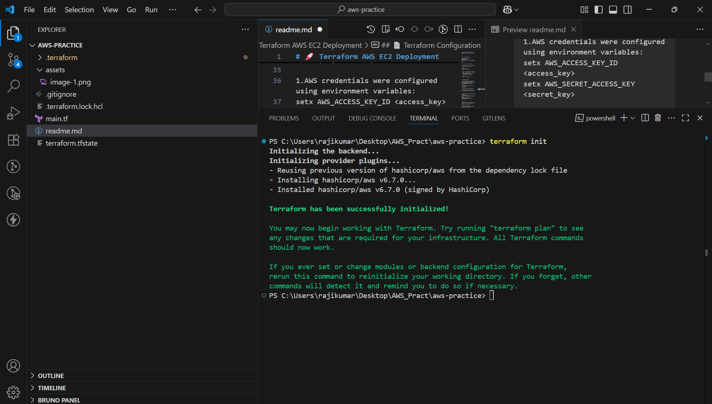

# 🚀 Terraform AWS EC2 Deployment

This project uses Terraform to provision a simple EC2 instance in AWS.

---

## 📁 Files Included

my-terraform-project/<br>
├── main.tf<br>
└── README.md<br>


---

## 📄 Terraform Configuration

A file named `main.tf` was created with the following content:

```hcl
provider "aws" {
  region = "us-east-1"
}

resource "aws_instance" "firstEC2" {
  ami           = "ami-0c02fb55956c7d316"  # Amazon Linux 2 AMI for us-east-1
  instance_type = "t2.micro"

  tags = {
    Name = "MyFirstEC2"
  }
}

⚙️ Deployment Steps

1.AWS credentials were configured using environment variables:
setx AWS_ACCESS_KEY_ID <access_key>
setx AWS_SECRET_ACCESS_KEY <secret_key>

2.Terraform initialization was performed:
terraform init

3.Execution plan was generated:

4.EC2 instance was verified in the AWS Console under region us-east-1.
terraform plan<br>


4.Infrastructure was destroyed after testing:
terraform destroy

  


🧾 Notes
AMI ID used: ami-0c02fb55956c7d316 (Amazon Linux 2 for us-east-1)

Instance type: t2.micro

Resource created: One EC2 instance with Name tag MyFirstEC2
