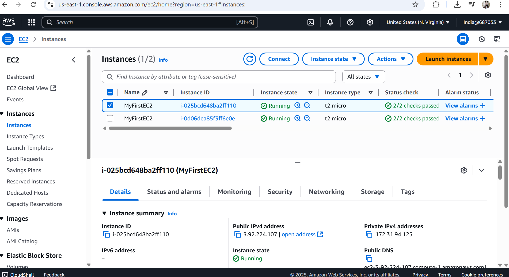
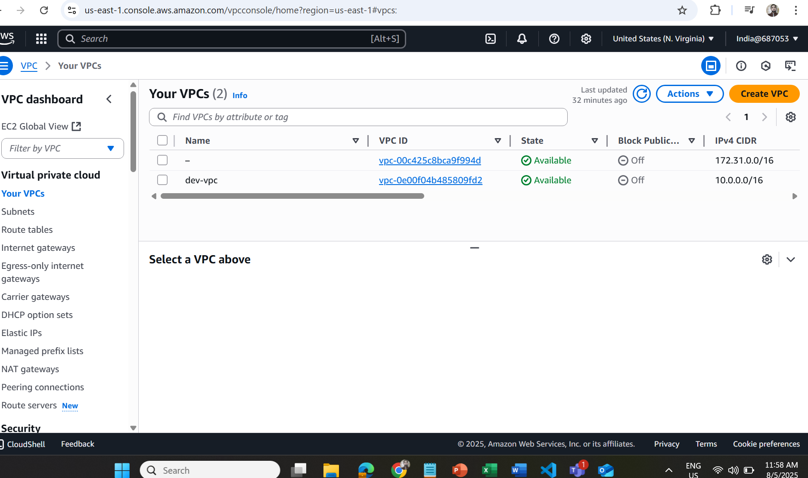
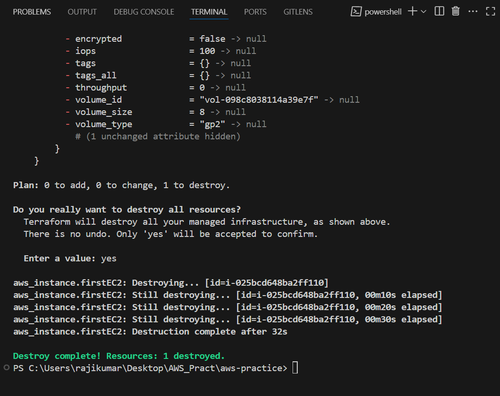
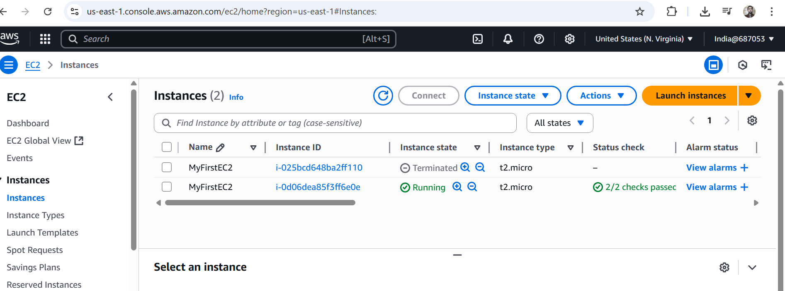
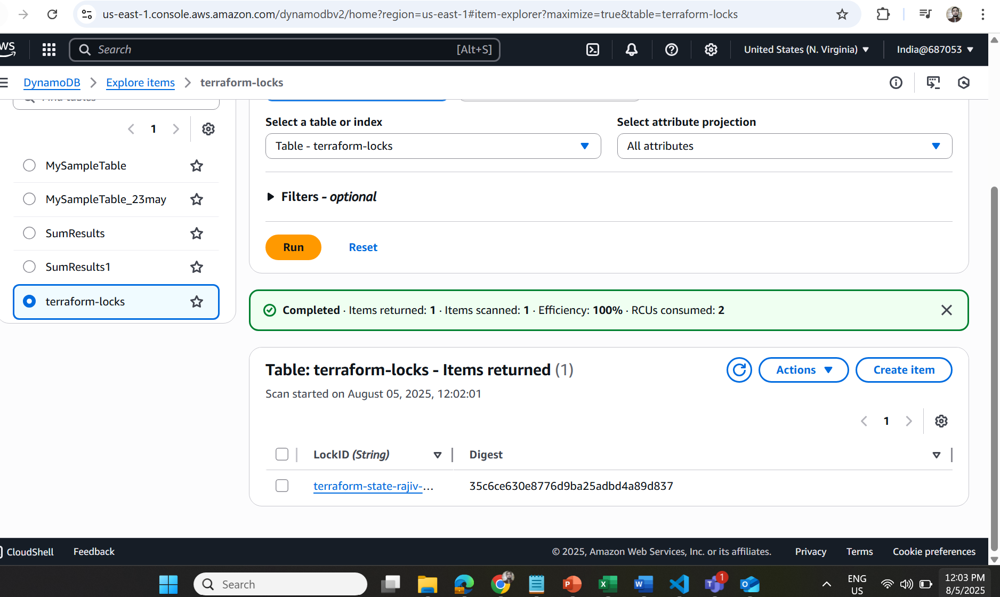
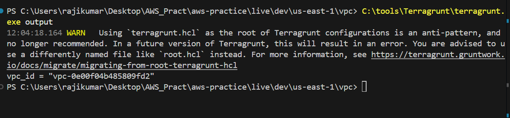

🚀 Terraform + Terragrunt Setup (AWS)
This guide explains how to set up infrastructure using Terraform modules with Terragrunt for DRY, maintainable, and environment-specific deployments.  

📁 Project Structure

🧱 Step 1: Create Terraform Module  

modules/vpc/main.tf
terraform {
  backend "s3" {} # Placeholder for Terragrunt
}

resource "aws_vpc" "main" {
  cidr_block = var.cidr_block
  tags = {
    Name = var.name
  }
} 

modules/vpc/variables.tf

variable "cidr_block" {
  type = string
}
variable "name" {
  type = string
}

🧩 Step 2: Setup Root Terragrunt Configuration  

live/terragrunt.hcl

locals {
  region = "us-east-1"
}

remote_state {
  backend = "s3"
  config = {
    bucket         = "terraform-state-rajiv-2025-xyz123"  # Replace with your unique S3 bucket
    key            = "${path_relative_to_include()}/terraform.tfstate"
    region         = local.region
    dynamodb_table = "terraform-locks"
    encrypt        = true
  }
}

generate "provider" {
  path      = "provider.tf"
  if_exists = "overwrite_terragrunt"
  contents  = <<EOF
provider "aws" {
  region = "${local.region}"
}
EOF
}

🌱 Step 3: Environment Configuration (Dev)

live/dev/us-east-1/vpc/terragrunt.hcl

include {
  path = find_in_parent_folders()
}

terraform {
  source = "../../../../modules/vpc"
}

inputs = {
  cidr_block = "10.0.0.0/16"
  name       = "dev-vpc"
}

🚀 Step 4: Create S3 Bucket & DynamoDB Table (Remote State)  

aws s3api create-bucket \
  --bucket terraform-state-rajiv-2025-xyz123 \
  --region us-east-1

aws dynamodb create-table \
  --table-name terraform-locks \
  --attribute-definitions AttributeName=LockID,AttributeType=S \
  --key-schema AttributeName=LockID,KeyType=HASH \
  --billing-mode PAY_PER_REQUEST

📦 Step 5: Run Terragrunt Commands

Navigate to the environment folder:
cd live/dev/us-east-1/vpc

Then run:

terragrunt init    # Initializes backend & modules
terragrunt plan    # Shows changes to be made
terragrunt apply   # Provisions infrastructure

✅ Step 6: Verify in AWS Console
VPC Dashboard:
Go to AWS Console → VPC → Your VPCs → Look for dev-vpc

S3 Bucket:
Go to AWS Console → S3 → terraform-state-rajiv-2025-xyz123  
Browse to:
dev/us-east-1/vpc/terraform.tfstate

DynamoDB Table:
Go to AWS Console → DynamoDB → terraform-locks
See the locking record during apply

To view outputs after apply:
terragrunt output

🔁  Apply All Modules at Once

terragrunt run-all init  
terragrunt run-all apply

📌 Notes  
S3 bucket name must be globally unique

Don’t forget to update region, bucket name, and tags

