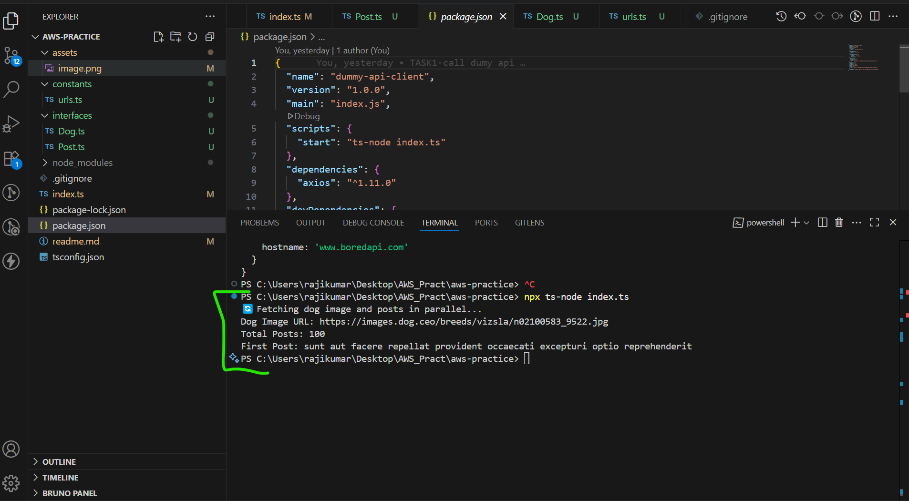

#  Parallel API Calls with Node.js + TypeScript

This project demonstrates how to use **Node.js** and **TypeScript** to fetch data from two public APIs **in parallel** using `axios`, `async/await`, and TypeScript **interfaces**.

---

## 🔗 APIs Used

- **Posts API** (Dummy blog posts):  
  `https://jsonplaceholder.typicode.com/posts`

- **Dog API** (Random dog image):  
  `https://dog.ceo/api/breeds/image/random`

---

## 🧱 Project Structure

---

## 📦 Setup & Run
### 1. Clone & Install

git clone <your-repo-url>
npm install

---

Run Code

npx ts-node index.ts

---
🧑‍💻 Tech Stack

TypeScript

Node.js

Axios

Promises, Async/Await

TypeScript Interfaces & Types

---

✅ Output

