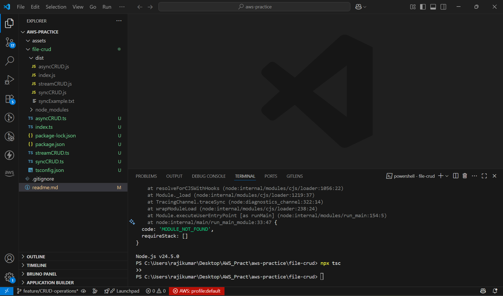

Node.js + TypeScript File CRUD Examples

This project demonstrates Create, Read, Update, Delete (CRUD) operations on files in three different ways using Node.js and TypeScript:

Synchronous – Blocking file operations (fs.writeFileSync, fs.readFileSync, etc.)

Asynchronous – Non-blocking operations using Promises (fs/promises)

Streams – Chunk-based reading and writing for large files

---

📂 Project Structure

---

⚡ Prerequisites

Node.js v18+

npm

TypeScript (installed locally or globally)

---

🛠 Installation  
Install dependencies: 
npm install 

Initialize TypeScript (if not already): 

npx tsc --init

---

🚀 How to Run  
Compile TypeScript files to JavaScript:

npx tsc

Run the program:  

node dist/index.js

---

📖 Features
1. Synchronous

Blocks execution until each operation finishes.

Simple for small scripts.

2. Asynchronous

Uses promises and await for non-blocking I/O.

Recommended for real-world applications.

3. Stream-based

Reads and writes files in chunks.

Efficient for large files.

Uses events (finish, data, end) for flow control.

---

🔧 Customization

To keep files after running, comment out the fs.unlink() lines in each module.

Change file names or paths inside each module to avoid overwriting existing files.

---

📌 Notes

No external npm packages required besides TypeScript and @types/node.

Works on Windows, macOS, and Linux.