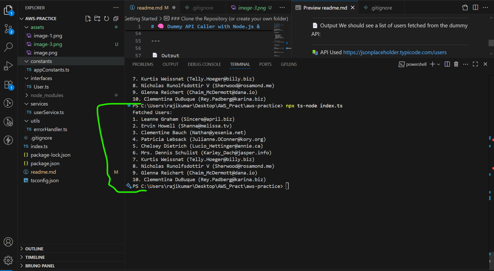
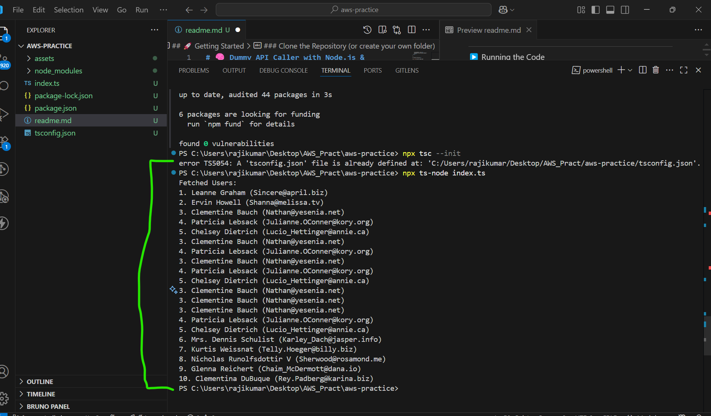

# 🧠 Dummy API Caller with Node.js & TypeScript

This is a simple Node.js + TypeScript project that fetches data from a dummy API using `axios`, `async/await`, and TypeScript interfaces.

---

## 📦 Prerequisites

- Node.js (v20+ recommended)
- npm  installed globally

---

## 🚀 Getting Started

###  Clone the Repository (or create your own folder)

Initialize the Project

npm init -y

Install Dependencies 
npm install axios 
npm install --save-dev typescript ts-node

 Setup TypeScript 
 npx tsc --init

{
  "compilerOptions": { 
    "target": "ES2020", 
    "module": "commonjs", 
    "strict": true, 
    "esModuleInterop": true, 
    "skipLibCheck": true, 
    "forceConsistentCasingInFileNames": true 
  } 
}

---
🧾 Project Structure 

---

▶️ Running the Code

npx ts-node index.ts

---

📄 Output
We should see a list of users fetched from the dummy API:

---

📚 API Used
https://jsonplaceholder.typicode.com/users

---

📌 Features
Written in TypeScript

Uses axios for HTTP requests

Uses Promises, async/await

Includes TypeScript interfaces and types